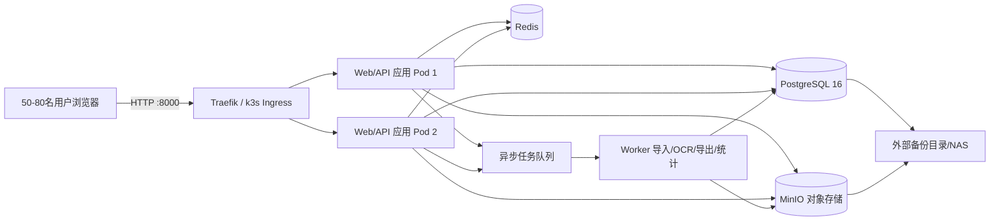

# 终端季度往来对账管理系统：软件架构与发布部署方案

> 文档状态：目标架构与后续开发约束
> 最后更新：2026-08-20
> 生产地址：`http://192.168.51.182:8000`
> 适用规模：50～80 名用户同时登录和使用

## 1. 文档目的

本文档是本系统后续开发、数据迁移、部署和运维的统一设计依据。开发人员和 AI 工具修改代码前，应先阅读本文档及仓库根目录的 `PROJECT_LOGIC.md`，不得自行改变业务字段含义、统计口径、数据权限或发布流程。

本方案遵循以下已确认决策：

1. 软件只在本地工作区修改。
2. 修改完成后提交并推送 Git，再部署到 `192.168.51.182`。
3. 正式访问地址只有 `http://192.168.51.182:8000`。
4. 不建设独立测试环境，不保留测试地址，不设置单独测试阶段。
5. 业务功能由项目负责人在正式地址自行验证。
6. 仍保留发布所必需的最低技术检查：代码可构建、容器可启动、健康检查通过、数据库可连接、发布前备份成功。这些检查不是独立测试环境，也不是业务测试门禁。
7. 应用与数据库逻辑分离，但现阶段均部署在 `192.168.51.182` 服务器。
8. 当前本地端全部有效业务数据必须完整迁移到服务器，迁移前后不得丢失、重复或改变字段含义。

## 2. 当前系统现状

### 2.1 当前技术栈

- 前端与服务端渲染：React 19、Next.js 16、Vinext、Vite、TypeScript。
- 数据访问：Drizzle ORM，当前代码包含 D1/SQLite 结构。
- 图表与文件：ECharts、XLSX、OCR/识别相关依赖。
- 部署：k3s，当前清单位于 `k8s/quarterly-recon.yaml`。
- 容器：当前 `Dockerfile.k3s` 仍以 `wrangler dev` 启动，属于过渡运行方式，不是目标生产运行方式。

### 2.2 当前数据保存方式

当前业务数据分散在以下位置：

- 浏览器 `localStorage`：季度档案、当前季度表、SPD 数据、筛选和业务状态等。
- 浏览器 `IndexedDB`：本季度对账详细情况及部分大数据。
- 服务器 `.wrangler` 持久化目录：D1/SQLite 数据和单份共享快照。
- `/api/local-state`：以一份 JSON 快照同步部分本地状态，存在大小上限，且不能可靠支撑 50～80 人并发写入。
- 导入文件、发票图片、OCR 文件和录音等资源尚未形成统一的服务器对象存储规范。

### 2.3 当前模式的主要问题

1. 浏览器数据不是多用户共享数据库，不同电脑、浏览器和地址之间可能看不到同一份数据。
2. 单份 JSON 快照存在覆盖写、并发冲突、数据体积和审计困难。
3. 浏览器关闭、缓存清理、地址变更或设备更换可能造成数据不可见。
4. 当前 `.wrangler` 开发态运行方式不适合长期生产保活和多实例扩容。
5. 应用、数据和文件缺少清晰边界，无法可靠执行备份、恢复、权限和审计。
6. 现有系统没有完整的服务端登录会话、行级数据权限和并发修改控制。

因此，现有保存方式只能作为迁移来源和过渡兼容层，不能继续作为正式系统的数据权威来源。

## 3. 目标总体架构



### 3.1 部署边界

所有组件现阶段部署在 `192.168.51.182` 的 k3s 中，但按独立工作负载和独立持久卷拆分：

- `quarterly-recon-web`：页面与 API，无状态，可运行 2 个副本。
- `quarterly-recon-worker`：Excel 解析、批量导入、OCR、导出和统计任务。
- `postgresql`：业务权威数据库，独立 StatefulSet、Service、Secret 和 PVC。
- `redis`：会话、缓存、分布式锁和任务队列。
- `minio`：Excel 原文件、发票图片、附件、录音、OCR 原图和导出文件。
- `traefik`：只对外暴露生产地址 `192.168.51.182:8000`。

逻辑分离不等于物理高可用。所有组件在同一台 182 服务器上时，服务器硬件故障仍会造成整体不可用，因此数据库和对象文件备份必须复制到另一台设备、NAS 或离线介质。

### 3.2 生产地址

- 唯一正式地址：`http://192.168.51.182:8000`
- 不再创建 `:8001` 或其他独立测试地址。
- 不使用 localhost、临时隧道或 ChatGPT Sites 地址作为正式业务入口。
- 发布后由用户直接在正式地址验证业务。

## 4. 数据架构

### 4.1 数据权威原则

1. PostgreSQL 是结构化业务数据的唯一权威来源。
2. MinIO 是附件和原始文件的唯一权威来源，PostgreSQL 只保存文件元数据、对象键和校验值。
3. Redis 数据可以丢弃和重建，不保存唯一业务事实。
4. 浏览器只保存登录令牌的安全会话标识、界面偏好、筛选条件和短期缓存，不再保存唯一业务数据。
5. 所有看板、导出和下钻明细必须读取同一套服务端数据和统一统计服务。

### 4.2 推荐业务域

PostgreSQL 至少按以下业务域设计表和服务：

- 账号与权限：用户、角色、区域权限、账套权限、登录会话。
- 基础资料：区域、账套、客户、负责人、季度。
- 对账主数据：季度对账记录、公司应收、客户账面金额、对账状态、解决时间、解决方案。
- 发票差额：六类差额明细、发票号、开票日期、金额、差额说明、往来核验结果。
- 往来发票：本年及历史往来明细、核验索引、来源文件和版本。
- 问题跟进：待解决清单、财务关注、处理阶段、跟进记录、已解决档案。
- 资料管理：资料提供情况、SPD 表、有效回函、未对账客户。
- 导入审计：导入批次、原文件、记录数、新增/更新/跳过/异常统计、操作者、撤回状态。
- 文件附件：文件对象、业务关联、SHA-256、大小、类型、上传人和保留策略。
- 操作审计：新增、修改、删除、导入、导出、状态流转和权限变化。

### 4.3 主键和唯一约束

- 不使用客户名称作为唯一键。
- 业务定位优先使用 `quarter + accountSetId + customerId + reconciliationId`。
- 发票优先使用 `invoiceId`；没有时使用 `quarter + accountSetId + customerId + invoiceNo` 组合唯一键。
- 所有导入批次、填写记录和跟进记录使用稳定 UUID。
- 数据库约束负责防止同一批次、同一客户或同一发票被重复导入。

### 4.4 并发与一致性

为支撑 50～80 人同时使用：

- 所有写入在数据库事务中完成。
- 对经常被多人修改的对账记录增加 `version` 或 `updated_at` 乐观锁。
- 保存时如果版本已变化，提示用户刷新并合并，禁止静默覆盖他人数据。
- 导入、撤回、归档、批量修改采用幂等任务和唯一请求键。
- 大文件导入、OCR、导出和聚合统计交由 Worker 执行，不阻塞 Web 请求。
- 常用筛选字段建立组合索引；看板使用聚合查询或可刷新汇总表，禁止一次拉取全部明细到浏览器统计。

## 5. 登录、权限和安全

### 5.1 权限模型

- 管理员/管理层：查看全部区域、账套和汇总数据。
- 财务主管：查看问题总览、财务介入和复核事项。
- 区域负责人/销售：仅查看和填写授权区域、账套和客户。
- 导出、导入、撤回、复核、归档和系统设置使用独立权限点。

权限必须由服务端查询条件和数据库访问层执行，不能只在前端隐藏按钮。

### 5.2 安全要求

- 密码使用 Argon2id 或 bcrypt 哈希，不保存明文。
- 登录会话存储在 Redis，Cookie 使用 `HttpOnly`、`SameSite`，在具备证书后启用 `Secure`。
- 数据库密码、MinIO 密钥、JWT/Session 密钥放入 k3s Secret，不提交 Git。
- 上传文件检查扩展名、MIME、大小和内容，文件名不得直接作为磁盘路径。
- OCR 地址、数据库地址等通过环境变量配置。
- 所有导入、导出、修改、撤回和权限操作写入审计日志。

## 6. 本地数据完整镜像迁移方案

### 6.1 迁移目标

把当前本地端能够看到的全部有效数据复制到 182 服务器，并保证：

- 记录数一致。
- 金额合计一致。
- 发票号、日期、金额、差额说明和分类一致。
- 空值仍为空值，不能把空白自动变成数字 `0`。
- 客户、账套、季度和发票关系不丢失。
- 已解决、待解决、资料、SPD、附件、录音和导入历史均可追溯。

### 6.2 迁移步骤

1. **只读盘点**：枚举 localStorage、IndexedDB、当前 D1/SQLite、`.wrangler`、上传文件和现有快照，不先删除或覆盖任何数据。
2. **冻结版本**：记录当前 Git commit、浏览器地址、数据更新时间和存储版本。
3. **生成迁移包**：导出 JSON/CSV/二进制文件，生成 `manifest.json`，记录来源、表名、季度、条数、金额合计、文件大小和 SHA-256。
4. **建立映射**：把旧键和旧字段映射到 PostgreSQL/MinIO；保留旧记录 ID 与新 UUID 的对应表。
5. **迁移前备份**：备份 182 当前 PostgreSQL、MinIO 和旧 `.wrangler` 目录。
6. **导入临时表**：先导入 staging 表并校验字段、空值、重复、日期和金额，再合并正式表。
7. **迁移文件**：附件、发票图片、录音、Excel 原文件进入 MinIO，并保存对象校验值。
8. **一致性复核**：逐季度、账套、区域比对记录数、客户数、发票数、公司应收、差额合计、已解决数和待解决数。
9. **业务抽样**：抽查至少每个账套和每种差额分类，确认发票与差额说明一一对应。
10. **切换权威源**：确认无误后，Web/API 只写 PostgreSQL/MinIO。
11. **保留原数据**：本地数据和旧 `.wrangler` 只读归档，不立即清除，至少保留一个完整回退周期。

### 6.3 迁移校验红线

- `空白`、`null`、`undefined` 和 `0` 必须区分。
- 未填写发票号的差额行不进行往来核验；日期和金额保持空白，不得因默认 `0` 触发核验。
- 同一发票的差额说明以本季度对账详细情况中的发票级记录为准。
- 迁移前后四/六类差额合计、客户差额和总差额必须一致。
- 出现记录数或金额差异时停止切换，不允许带差异上线。

## 7. 日常软件修改与发布流程

### 7.1 已确认的发布链路

```text
本地修改
  ↓
本地最低技术检查
  ↓
Git commit + push
  ↓
182 发布前数据备份
  ↓
构建带版本号的容器镜像
  ↓
k3s 更新正式服务 :8000
  ↓
健康检查
  ↓
用户在正式地址进行业务测试
  ↓
确认保留或执行回滚
```

### 7.2 本地修改规则

- 所有代码修改在本地仓库完成。
- 修改前先拉取最新代码并确认工作区，禁止覆盖用户未提交修改。
- 每个业务修改使用清晰的 Git commit；提交信息写明页面、业务口径和影响范围。
- 数据库结构变更必须附带可重复执行的版本化 migration，禁止人工直接改生产表后不留脚本。
- 不在源码中硬编码服务器密码、数据库密码或 OCR 密钥。

### 7.3 最低技术检查

用户已明确取消独立测试环境和单独测试阶段，但以下检查仍是发布动作的一部分：

1. 代码能够完成生产构建或至少通过项目实际发布构建命令。
2. 容器能够启动，不存在明显启动错误。
3. 数据库 migration 可执行且有备份。
4. Pod readiness/liveness 正常。
5. `http://192.168.51.182:8000` 能返回正常页面，服务端能连接 PostgreSQL、Redis 和 MinIO。

不单独创建测试地址，不要求开发方代替用户执行完整业务用例；业务验收由用户在正式地址完成。

### 7.4 Git 规则

- `main` 作为正式部署来源。
- 每次部署必须对应唯一 Git commit SHA 和版本号。
- 推送 Git 后，182 服务器按该 SHA 构建镜像，禁止用未提交的本地文件直接覆盖服务器。
- 镜像标签建议：`quarterly-recon:<YYYYMMDD-HHmm>-<shortSHA>`，禁止长期复用同一个 `latest/current` 标签而无法回退。

### 7.5 182 部署规则

1. 记录当前线上镜像、Git SHA 和数据库 schema 版本。
2. 备份 PostgreSQL 和本次涉及的 MinIO 对象。
3. 执行向前兼容的数据库 migration。
4. 构建并导入带版本号镜像。
5. 更新 k3s Deployment 镜像标签。
6. 等待新 Pod Ready，再停止旧 Pod；不得先删除唯一可用实例。
7. 检查首页、API 健康状态和数据库连接。
8. 将版本、发布时间、操作者、migration、备份位置和结果写入发布记录。

### 7.6 用户验收与回滚

- 用户直接在正式地址测试业务。
- 用户确认正常后保留新版本。
- 若发现程序问题，优先回滚到上一个镜像标签。
- 若 migration 仅新增兼容字段，应用可先回滚而数据库保留新字段。
- 只有数据被错误修改且无法向前修复时，才恢复数据库备份；恢复前再次备份当前现场。
- 发布期间产生的新业务数据不得因应用回滚而丢失。

## 8. k3s 目标部署结构

建议命名空间：`quarterly-recon`

```text
Namespace quarterly-recon
├─ Deployment/quarterly-recon-web        replicas: 2
├─ Service/quarterly-recon-web           ClusterIP
├─ Ingress/quarterly-recon               :8000
├─ Deployment/quarterly-recon-worker     replicas: 1
├─ StatefulSet/postgresql                replicas: 1 + 独立PVC
├─ Service/postgresql                    仅集群内访问
├─ StatefulSet/redis                     replicas: 1 + 独立PVC（可选AOF）
├─ Service/redis                         仅集群内访问
├─ StatefulSet/minio                     replicas: 1 + 独立PVC
├─ Service/minio                         仅集群内访问
├─ Secret/quarterly-recon-secrets
├─ ConfigMap/quarterly-recon-config
└─ CronJob/backup-postgres-and-files
```

数据库、Redis 和 MinIO 不通过宿主机端口向普通用户开放，只允许应用 Pod 和受控运维入口访问。

## 9. 备份与恢复

### 9.1 备份策略

- PostgreSQL：每日全量备份，业务高峰期外执行；建议增加 WAL 归档或增量备份。
- MinIO：每日增量同步，重要导入和发布前额外快照。
- k3s 清单、Secret 模板、migration 和部署脚本由 Git 管理；真实 Secret 单独加密备份。
- 至少保留 7 个日备份、4 个周备份和 6 个季度归档，具体可按存储容量调整。
- 备份副本必须离开 182 本机，存入 NAS、另一服务器或离线硬盘。

### 9.2 恢复演练

- 每季度至少执行一次 PostgreSQL 与附件恢复演练。
- 验证恢复后的季度数、客户数、发票数、金额汇总和文件校验值。
- 仅“存在备份文件”不等于可恢复，必须实际验证恢复命令。

## 10. 容量和性能建议

50～80 人并发以表格查询、填写、导入和看板为主，推荐 182 服务器至少：

- 最低：8 核 CPU、16 GB 内存、SSD、可用空间 300 GB。
- 推荐：16 核 CPU、32 GB 内存、SSD/NVMe、可用空间 500 GB 以上。
- 若 OCR 与大 Excel 解析同机运行，优先采用推荐配置，并限制 Worker 并发数。
- PostgreSQL 建议预留 6～10 GB 内存，应用 Pod 每个 1～2 GB，Worker 4～8 GB，MinIO/Redis 预留独立资源限额。
- 附件和导入原文件容量应按季度增长率持续监控。

## 11. 分阶段落地顺序

### 阶段 0：保护现有数据

- 停止任何清除本机数据操作。
- 完成本地存储、IndexedDB、D1 和文件盘点。
- 制作可校验迁移包和全量备份。

### 阶段 1：服务器基础设施

- 在 182 k3s 部署 PostgreSQL、Redis、MinIO、备份 CronJob 和 Secret。
- 不改变正式访问地址。

### 阶段 2：服务端数据 API 与登录权限

- 把核心读取和写入从浏览器存储迁移到 API/PostgreSQL。
- 落地账号、角色、区域/账套数据权限、审计和乐观锁。

### 阶段 3：数据迁移

- 导入全量本地数据和文件。
- 完成自动校验、金额对账和业务抽样。

### 阶段 4：正式切换

- 备份、增量同步、短维护窗口、切换服务端权威数据源。
- 正式地址保持 `http://192.168.51.182:8000`。
- 用户在正式地址验收。

### 阶段 5：常态发布

- 后续全部修改遵循“本地修改 → Git push → 备份 → 部署 182 → 健康检查 → 用户验收”。

## 12. 验收标准

### 12.1 架构验收

- 应用与 PostgreSQL、Redis、MinIO 使用独立工作负载、服务和持久卷。
- 应用 Pod 无状态，可滚动更新和横向扩容。
- 数据库和对象存储不向普通网络直接开放。
- 正式地址只有 `192.168.51.182:8000`，没有独立测试地址。

### 12.2 数据迁移验收

- 所有本地季度、账套、区域、客户、发票、差额、跟进、档案、资料和文件完整迁移。
- 迁移前后记录数、金额合计、发票关联和状态一致。
- 空白值没有被错误转换为 `0`。
- 浏览器刷新、换电脑和多人登录后看到同一份授权范围内数据。

### 12.3 发布验收

- 每次部署可追溯到 Git SHA、镜像标签、备份和发布记录。
- 新版本启动和健康检查通过。
- 用户在正式地址完成业务验证。
- 出现问题时可回滚应用版本，且不丢失发布后产生的业务数据。

## 13. AI 与开发人员继续工作的强制约束

任何 AI 或开发人员在修改本系统前必须：

1. 阅读本文件和 `PROJECT_LOGIC.md`。
2. 先确认当前分支、Git 状态、生产版本和实际数据来源。
3. 不删除现有接口，不改变原字段含义，不把空白值自动转换为 `0`。
4. 不重新引入浏览器 localStorage/IndexedDB 作为唯一业务数据源。
5. 不把客户名称作为唯一关联键。
6. 不在前端为不同看板重复编写不同统计口径。
7. 不创建独立测试地址；业务修改最终部署到 `192.168.51.182:8000`。
8. 不因“无需单独测试”而省略构建、备份、服务健康和数据库连接检查。
9. 不执行破坏性清理、覆盖数据库或清除用户数据，除非用户明确授权且已有可恢复备份。
10. 修改数据库时提供 migration；修改部署时保留上一个可回滚镜像。

建议后续补充并持续维护：

- `docs/DATA_MIGRATION_MAPPING.md`：旧存储到 PostgreSQL 的逐字段映射和核对结果。
- `docs/DEPLOYMENT_RUNBOOK.md`：182 服务器实际部署、备份和回滚命令。
- `docs/RELEASE_LOG.md`：每次 Git SHA、镜像、migration、备份和用户验收结果。

## 14. 决策记录

| 日期 | 决策 | 说明 |
|---|---|---|
| 2026-08-20 | 正式地址固定为 `192.168.51.182:8000` | 后续修改均部署到该地址 |
| 2026-08-20 | 取消独立测试环境和测试地址 | 用户在正式地址进行业务测试 |
| 2026-08-20 | 发布链路固定为本地修改、Git 推送、部署 182 | 仍保留备份、构建和健康检查 |
| 2026-08-20 | 应用与数据库逻辑分离 | PostgreSQL 独立工作负载和持久卷，现阶段同机部署 |
| 2026-08-20 | 本地数据完整镜像到 182 | 迁移必须校验记录、金额、关联、空值和附件 |
